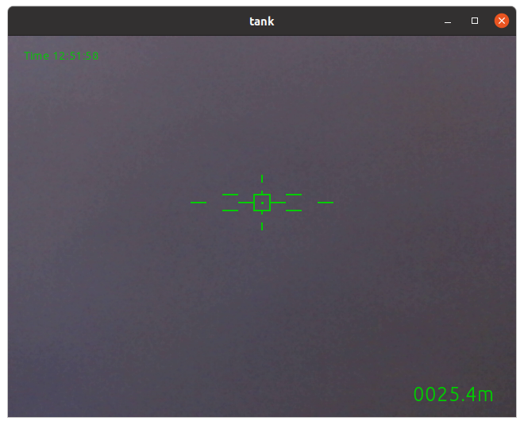

# gst-tank-overlay

Install the following dependencies before building:

``` .bash
apt-get install gstreamer1.0-dev libgstreamer-plugins-base1.0-dev libcairo2-dev gstreamer1.0-libav
```

## H.264 RTP streaming

``` .bashrc
gst-launch-1.0 v4l2src device=/dev/video0 ! videoconvert ! vaapih264enc ! rtph264pay config-interval=1 ! udpsink host=127.0.0.1 port=5006
```

## Screenshot


